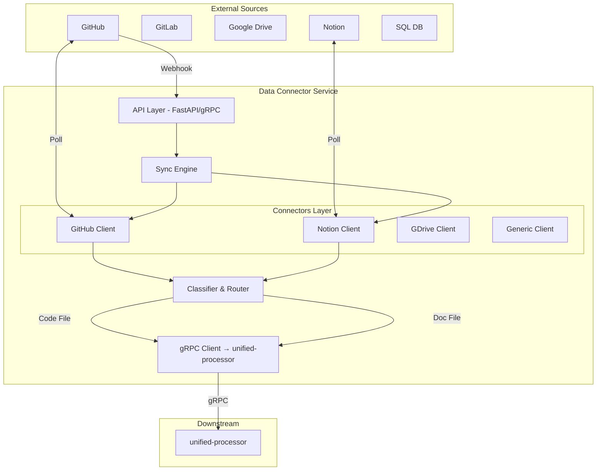

# Architecture

The Data Connector operates as a high-throughput gateway that ingests data from external sources and forwards it to the unified-processor via gRPC for downstream processing.

## High-Level Design



## Component Breakdown

### 1. API Layer
- **gRPC**: Handles administrative tasks like adding a new source, listing jobs, and manual sync triggers.
- **HTTP**: Receives OAuth callbacks and incoming webhooks from providers like GitHub.

### 2. Connector Layer
- **Abstract Base Class**: All connectors inherit from a common base ensuring consistent behavior (auth, fetch, list).
- **Specific Implementations**:
    - `GitHubConnector`: Handles git tree traversal and blob downloads.
    - `NotionConnector`: Converts Notion blocks to Markdown.
    - `DriveConnector`: Downloads and converts office docs to PDF/Text.

### 3. Sync Engine
- **Polling Manager**: Scheduled tasks (APScheduler) that check for changes in connected sources.
- **Webhook Handler**: Processes real-time events (Push, Merge) and triggers immediate syncs.
- **State Manager**: Tracks the last synced commit/timestamp to enable incremental syncing.

### 4. Classifier & Router
- **Extension Logic**: strictly maps file extensions to types (e.g., `.py` -> Code, `.md` -> Doc).
- **Routing**: Classifies files by type (Code vs Docs) and forwards them to unified-processor via gRPC.

### 5. gRPC Client (unified-processor)
- **Connection Management**: Establishes async gRPC channel to unified-processor service
- **Health Checking**: Validates connectivity on startup with health check RPC
- **Proto Stubs**: Uses generated protobuf stubs from `proto/unified_processor.proto`
- **Error Handling**: Graceful handling of connection failures with detailed logging
- **Status Handling**: Uses gRPC status codes for rich error information
- **Reflection Support**: Enables gRPC server reflection for debugging and tooling
- **Configuration**: Uses `unified_processor_url` from settings for service address

**gRPC Dependencies** (v1.60.0+):
- `grpcio`: Core gRPC runtime for Python
- `grpcio-tools`: Protocol buffer compiler and code generator
- `grpcio-status`: Rich status code support for detailed error handling
- `grpcio-reflection`: Server reflection for service discovery and debugging

**Prerequisites**: Proto stubs must be generated before running:
```bash
# Windows
./proto/generate_stubs.ps1

# Linux/Mac
./proto/generate_stubs.sh
```

### 6. Data Flow

#### Standard Source Sync Flow
1. **Trigger**: Webhook or Scheduled Poll initiates a sync.
2. **Fetch**: Connector retrieves file metadata (name, size, hash).
3. **Filter**: Ignores binary/large files based on config.
4. **Download**: Content is downloaded into memory.
5. **Classify**: File type is determined.
6. **Forward**: Data is sent to unified-processor via gRPC with content and metadata.

#### Document Upload Flow
1. **Upload**: User uploads documents via `/api/v1/documents/upload` endpoint
2. **Source Creation**: A new source with type "UPLOAD" is created in MongoDB
3. **Validation**: File extensions are validated against supported document types
4. **Processing**: Each file is immediately processed:
   - File content is read into memory
   - File type is determined from extension
   - File is forwarded to unified-processor via gRPC
5. **Response**: Returns summary with processed and failed files

**Supported Document Types:**
- PDF, DOCX, DOC, TXT, MD, MARKDOWN, HTML, HTM, RTF

**Key Differences from Sync Flow:**
- No polling or webhooks - immediate processing
- No filtering by size/binary (validation by extension only)
- Synchronous processing (not background task)
- Creates ephemeral source per upload batch

## Observability

### Monitoring & Metrics
The service exposes Prometheus metrics at `/metrics` endpoint for monitoring:

**HTTP Metrics:**
- `http_requests_total`: Total HTTP requests by method, endpoint, and status code
- `http_request_duration_seconds`: Request duration histogram by method and endpoint
- `active_connections`: Current number of active HTTP connections

**Processing Metrics:**
- `processing_jobs_total`: Total processing jobs by status and source type
- `processing_job_duration_seconds`: Job duration histogram by source type

**Infrastructure Metrics:**
- `database_connections_active`: Number of active database connections

### Structured Logging
- **Format**: JSON-structured logs via structlog
- **Output**: Console (stdout) and rotating log files
- **Files**: 
  - `logs/data-connector.log`: All logs (INFO+)
  - `logs/data-connector-error.log`: Error logs only
- **Rotation**: 10MB per file, 5 backup files
- **Context**: Request ID, operation ID, timestamps, and contextual metadata

### Request Tracing
Each HTTP request is assigned a unique `request_id` for distributed tracing and log correlation.
