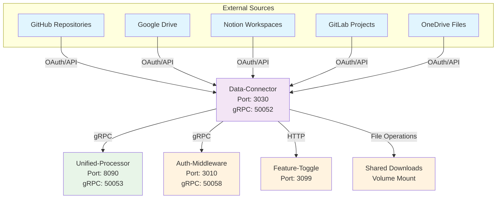
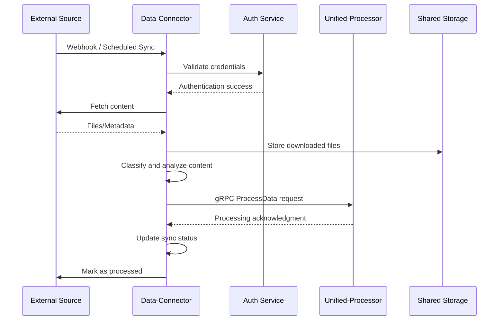

# ConFuse Data Connector

> **Universal Data Source Integration Service**

## What is this service?

The **data-connector** is ConFuse's universal data ingestion service that connects to external data sources, processes content, and routes it to the unified-processor for knowledge graph integration. It handles **data source ingestion ONLY** - not AI agent queries.

## Quick Start

```bash
# Clone and install
git clone https://github.com/confuse/data-connector.git
cd data-connector

# Setup Python environment
python -m venv .venv
source .venv/bin/activate  # Linux/Mac
# or .venv\Scripts\activate  # Windows

# Install dependencies
pip install -e .

# Configure environment
cp .env.map.example .env.map
cp .env.secret.example .env.secret

# Generate gRPC stubs
./proto/generate_stubs.sh  # Linux/Mac
# or ./proto/generate_stubs.ps1  # Windows

# Start the service
uvicorn app.main:app --host 0.0.0.0 --port 3030
```

The service starts at:
- **HTTP**: `http://localhost:3030`
- **gRPC**: `localhost:50052`

## API Endpoints

### REST API (Port 3030)

#### Health and Status
```http
# Health check
GET /health

# Service status
GET /status

# Detailed health with dependencies
GET /health/detailed
```

#### Source Management
```http
# List all sources
GET /api/sources

# Create new source
POST /api/sources
{
  "name": "GitHub Repository",
  "type": "github",
  "config": {
    "repository": "owner/repo",
    "branch": "main",
    "access_token": "github_token"
  }
}

# Get source details
GET /api/sources/{source_id}

# Update source
PUT /api/sources/{source_id}

# Delete source
DELETE /api/sources/{source_id}
```

#### Sync Operations
```http
# Trigger sync for source
POST /api/sources/{source_id}/sync

# Get sync status
GET /api/sources/{source_id}/sync/status

# List sync jobs
GET /api/v1/sync/jobs

# Get job details
GET /api/v1/sync/jobs/{job_id}
```

#### Webhook Endpoints
```http
# GitHub webhook
POST /webhooks/github

# GitLab webhook
POST /webhooks/gitlab

# Generic webhook
POST /webhooks/generic
```

### gRPC removed

Data-connector no longer exposes or depends on gRPC. All hot-path forwarding to the `unified-processor` is done via Kafka events. The repository's gRPC stubs and server components have been removed; developers should use the Kafka-based APIs and the `KAFKA_*` environment variables described above.

## Ingestion Pipeline

### Ingestion Flow

The ingestion process is the core "hot path" of the Data Connector:

1. **Discovery**: The connector identifies files to sync
   - *Full Sync*: Lists all files in the source
   - *Incremental*: Queries for changes since `last_sync_timestamp`

2. **Filtering**: Files are checked against ignore rules
   - `.gitignore` patterns
   - Binary extensions
   - Size limits

3. **Fetching**: Content is retrieved from source

4. **Classification**: Files are classified by type
   - **Code**: `.py`, `.js`, `.rs`, `.go`, `.java`, `.c`, `.cpp`, `.h`, `.ts`, `.tsx`, `.sql`, `.sh`, `.yaml`, `.json`, `.xml`, `.dockerfile`
   - **Documents**: `.md`, `.txt`, `.pdf`, `.doc`, `.docx`, `.rtf`, `.html`, `.csv`, `.xls`, `.ppt`

5. **Event Creation**: Strictly typed event objects are created

6. **Forwarding**: Events sent to unified-processor via gRPC

### Classification Logic

The routing logic relies on strictly defined file extensions:

**Code Files**: Sent to unified-processor for AST analysis and chunking
**Document Files**: Sent to unified-processor for embedding generation
**Unknown Types**: Skipped to avoid binary pollution

### gRPC Event Payloads

#### Code Ingested Payload
```json
{
  "file_id": "uuid-v4",
  "source_id": "github-repo-id",
  "file_path": "src/main.py",
  "file_name": "main.py",
  "file_extension": "py",
  "language": "python",
  "content_hash": "sha256-hash",
  "file_type": "code",
  "is_config": false,
  "metadata": {
    "size": 1024,
    "created_at": "2026-01-01T00:00:00Z",
    "modified_at": "2026-01-01T12:00:00Z",
    "author": "developer@example.com",
    "commit_sha": "abc123"
  }
}
```

#### Document Ingested Payload
```json
{
  "file_id": "uuid-v4",
  "source_id": "notion-page-id",
  "file_path": "Engineering/Design Docs/Architecture.md",
  "document_type": "markdown",
  "file_type": "document",
  "content_hash": "sha256-hash",
  "metadata": {
    "size": 2048,
    "created_at": "2026-01-01T00:00:00Z",
    "modified_at": "2026-01-01T12:00:00Z",
    "author": "author@example.com"
  }
}
```

### Sync Strategies

#### Incremental Sync
Most efficient. Connectors query provider for "changes since X":
- **GitHub**: `commits?since=timestamp`
- **Google Drive**: `changes/list?pageToken=token`

#### Full Sync
Used on initial connection or manual trigger. Iterates entire tree. Resource-intensive and rate-limited.

#### Webhook-Driven Sync
Real-time sync triggered by external events:
- **GitHub**: Push, pull request, issue events
- **GitLab**: Merge request, pipeline events
- **Notion**: Page creation, update, deletion

### Error Handling

#### Retry Logic
- **Exponential Backoff**: 1s, 2s, 4s, 8s, 16s max
- **Max Retries**: 3 attempts for API calls
- **Circuit Breaker**: Fail fast after 10 consecutive failures

#### Error Classification
```python
class ConnectorError(Exception):
    def __init__(self, message: str, error_type: str, retry: bool = False):
        self.message = message
        self.error_type = error_type  # auth, network, rate_limit, etc.
        self.retry = retry
```

### Performance Optimization

#### Batch Processing
- **Batch Size**: 100 files per batch
- **Parallel Processing**: 5 concurrent connections
- **Memory Management**: Streaming for large files

#### Caching
- **Source Metadata**: Cache source configurations
- **File Metadata**: Cache file listings for 1 hour
- **OAuth Tokens**: Cache access tokens with refresh

## Documentation

| Document | Description |
|----------|-------------|
| [Architecture](architecture.md) | Service design and data flow |
| [Configuration](configuration.md) | Environment variables |
| [Source Connectors](connectors.md) | Data source integrations |

## How It Fits in ConFuse



## Key Features

### 1. **Universal Source Integration**
- **Git Repositories**: GitHub, GitLab, Bitbucket integration
- **Document Storage**: Google Drive, OneDrive, Dropbox access
- **Productivity Tools**: Notion, Confluence workspace sync
- **API Sources**: REST API and webhook support
- **Local Files**: File system and network share access

### 2. **Intelligent Content Processing**
- **File Type Detection**: Automatic classification of code vs documents
- **Content Analysis**: Language detection and structure analysis
- **Metadata Extraction**: Author, timestamps, file relationships
- **Change Detection**: Incremental sync and delta processing

### 3. **Secure Authentication**
- **OAuth 2.0**: Standard OAuth flow for supported platforms
- **API Keys**: Secure API key management
- **Token Storage**: Encrypted token persistence
- **Permission Scoping**: Minimal required permissions only

### 4. **High-Performance Ingestion**
- **Parallel Processing**: Concurrent file downloads and processing
- **Streaming**: Large file streaming to minimize memory usage
- **Batch Operations**: Efficient bulk operations
- **Rate Limiting**: Respect API limits of external services

## Technology Stack

| Technology | Purpose | Version |
|------------|---------|---------|
| **Python** | Runtime | >=3.14 |
| **FastAPI** | Web Framework | >=0.109.0 |
| **gRPC** | Service Communication | >=1.60.0 |
| **Pydantic** | Data Validation | >=2.5.0 |
| **GitPython** | Git Operations | Latest |
| **httpx** | HTTP Client | >=0.26.0 |
| **aiofiles** | Async File I/O | Latest |

## Supported Data Sources

### Code Repositories

#### GitHub
- **Authentication**: OAuth 2.0 or Personal Access Token
- **Access**: Public and private repositories
- **Features**: Commits, branches, releases, issues
- **Limits**: GitHub API rate limiting respected

#### GitLab
- **Authentication**: OAuth 2.0 or Personal Access Token
- **Access**: Self-hosted and GitLab.com
- **Features**: Repositories, merge requests, pipelines
- **Webhooks**: Push/merge request webhooks supported

#### Bitbucket
- **Authentication**: OAuth 2.0 or App Passwords
- **Access**: Bitbucket Cloud and Server
- **Features**: Repositories, pull requests, pipelines
- **Workspace**: Multi-workspace support

### Document Storage

#### Google Drive
- **Authentication**: OAuth 2.0 with Google Workspace
- **File Types**: Docs, Sheets, Slides, PDF, images
- **Features**: Shared drives, folder hierarchy
- **Export**: Native format conversion support

#### OneDrive
- **Authentication**: Microsoft Graph OAuth 2.0
- **File Types**: Office documents, PDF, images
- **Features**: Personal and business OneDrive
- **Sharing**: Shared folder and file access

#### Dropbox
- **Authentication**: OAuth 2.0
- **File Types**: All file types supported
- **Features**: Team folders, version history
- **Sync**: Selective folder synchronization

#### Notion
- **Authentication**: OAuth 2.0
- **Content Types**: Pages, databases, blocks
- **Features**: Workspace sync, relationship mapping
- **Export**: Rich text and structured data

### File Types Supported

#### Code Files
```
Languages: Python, JavaScript, TypeScript, Java, Go, Rust, C/C++, C#, PHP, Ruby
Extensions: .py, .js, .ts, .java, .go, .rs, .c, .cpp, .cs, .php, .rb
Frameworks: React, Vue, Angular, Django, Flask, Spring, Express
```

#### Document Files
```
Formats: PDF, DOCX, TXT, MD, HTML, XML
Extensions: .pdf, .docx, .txt, .md, .html, .xml
Rich Text: RTF, ODT, Pages (with conversion)
```

#### Configuration Files
```
Formats: YAML, JSON, TOML, INI, XML
Extensions: .yml, .yaml, .json, .toml, .ini, .xml
Use Cases: Docker, Kubernetes, CI/CD, application config
```

## Service Architecture

### Core Components

#### 1. **Source Manager**
- **Connector Registry**: Dynamic connector loading
- **Authentication Manager**: OAuth flow and token management
- **Rate Limiter**: API rate limiting and backoff handling
- **Error Handler**: Retry logic and error recovery

#### 2. **Content Processor**
- **File Classifier**: Content type and language detection
- **Metadata Extractor**: File metadata and relationship extraction
- **Change Detector**: Delta processing and incremental updates
- **Content Analyzer**: Structure and complexity analysis

#### 3. **Integration Layer**
- **gRPC Client**: Communication with unified-processor
- **Event Publisher**: Ingestion event streaming
- **Storage Manager**: Shared download volume management
- **Webhook Handler**: External webhook processing

## API Endpoints

### REST API (Port 3030)

#### Source Management
```http
# List all configured sources
GET /api/sources

# Add new source
POST /api/sources
{
  "type": "github",
  "name": "My Repository",
  "config": {
    "repository": "owner/repo",
    "branch": "main"
  }
}

# Get source details
GET /api/sources/{source_id}

# Update source configuration
PUT /api/sources/{source_id}

# Delete source
DELETE /api/sources/{source_id}
```

#### Sync Operations
```http
# Trigger full sync
POST /api/v1/sync/{source_id}

# Trigger incremental sync
POST /api/v1/sync/{source_id}/incremental

# Get sync status
GET /api/v1/sync/{source_id}/status

# List sync history
GET /api/v1/sync/{source_id}/history
```

#### Authentication
```http
# Initiate OAuth flow
GET /auth/{provider}/authorize

# OAuth callback
GET /auth/{provider}/callback

# Store API key
POST /auth/api-keys
{
  "provider": "github",
  "key": "ghp_...",
  "name": "Production Key"
}

# List stored credentials
GET /auth/credentials
```

### gRPC Service (Port 50052)

#### Source Operations
```protobuf
service DataConnector {
  rpc CreateSource(CreateSourceRequest) returns (Source);
  rpc ListSources(ListSourcesRequest) returns (ListSourcesResponse);
  rpc GetSource(GetSourceRequest) returns (Source);
  rpc DeleteSource(DeleteSourceRequest) returns (DeleteSourceResponse);
  
  rpc SyncSource(SyncSourceRequest) returns (SyncResponse);
  rpc GetSyncStatus(GetSyncStatusRequest) returns (SyncStatus);
  
  rpc ValidateCredentials(ValidateCredentialsRequest) returns (ValidationResponse);
}
```

## Environment Configuration

### Required Environment Variables

#### `.env.map` (Non-sensitive)
```bash
# Service Configuration
PORT=3030
HOST=0.0.0.0
DEBUG=false
ENVIRONMENT=production

# gRPC Service Addresses
GRPC_PORT=50052
UNIFIED_PROCESSOR_GRPC_ADDR=localhost:50053
AUTH_MIDDLEWARE_GRPC_ADDR=auth-middleware:50058

# HTTP Service URLs
AUTH_SERVICE_URL=https://auth-middleware-fcg0.onrender.com
FEATURE_TOGGLE_SERVICE_URL=http://feature-toggle:3099


# Shared Storage
# DOWNLOADS_BASE_PATH - Optional: Override default temp directory location
# Default: System temp directory + "confuse-downloads"
# Production: Set to shared volume path (e.g., /shared/downloads)
# DOWNLOADS_BASE_PATH=/shared/downloads

# OAuth Callback URLs
GOOGLE_REDIRECT_URI=http://localhost:3030/auth/google/callback
MICROSOFT_REDIRECT_URI=http://localhost:3030/auth/microsoft/callback
GITHUB_REDIRECT_URI=http://localhost:3030/auth/github/callback

# CORS Configuration
CORS_ORIGINS=http://localhost:3000,https://confuse.platform.example.com
```

#### `.env.secret` (Sensitive)
```bash
# Database
POSTGRES_CONNECTION_STRING=postgresql://...

# External API Keys
GOOGLE_CLIENT_ID=your_google_client_id
GOOGLE_CLIENT_SECRET=your_google_client_secret

MICROSOFT_CLIENT_ID=your_microsoft_client_id
MICROSOFT_CLIENT_SECRET=your_microsoft_client_secret

GITHUB_CLIENT_ID=your_github_client_id
GITHUB_CLIENT_SECRET=your_github_client_secret

GITLAB_CLIENT_ID=your_gitlab_client_id
GITLAB_CLIENT_SECRET=your_gitlab_client_secret

# Encryption
ENCRYPTION_KEY=your_32_character_encryption_key
```

## Data Flow Architecture

### Ingestion Pipeline


### Sync Workflow
1. **Trigger**: Webhook, scheduled sync, or manual trigger
2. **Authentication**: Validate stored credentials
3. **Discovery**: Enumerate available content
4. **Filtering**: Apply inclusion/exclusion rules
5. **Download**: Fetch content to shared storage
6. **Processing**: Classify and analyze content
7. **Routing**: Send to unified-processor via gRPC
8. **Cleanup**: Remove temporary files
9. **Status**: Update sync status and metrics

## Security Model

### Authentication Security
- **OAuth 2.0**: Industry-standard authentication flow
- **Token Encryption**: Encrypted storage of access tokens
- **Scope Limitation**: Request minimal required permissions
- **Token Refresh**: Automatic token refresh handling

### Data Security
- **Transit Encryption**: TLS 1.3 for all external connections
- **Storage Security**: Encrypted credential storage
- **Access Control**: Role-based access to source configurations
- **Audit Logging**: Complete audit trail of all operations

### Network Security
- **CORS Configuration**: Restricted cross-origin requests
- **Rate Limiting**: API abuse prevention
- **Input Validation**: Comprehensive input sanitization
- **Error Handling**: Secure error message generation

## Monitoring & Observability

### Metrics Collection
- **Source Health**: Connection status and availability
- **Sync Performance**: Ingestion speed and success rates
- **Error Rates**: Failed operations and error categories
- **Resource Usage**: Memory, CPU, and storage consumption

### Logging Strategy
- **Structured Logging**: JSON format with correlation IDs
- **Log Levels**: DEBUG, INFO, WARNING, ERROR, CRITICAL
- **Security Events**: Authentication and authorization logging
- **Performance Metrics**: Operation timing and throughput

### Health Monitoring
```bash
# Service health check
GET /health

# Detailed status
GET /status

# Source connectivity
GET /health/sources
```

## Development

### Local Development Setup
```bash
# Install development dependencies
pip install -e ".[dev]"

# Setup pre-commit hooks
pre-commit install

# Run with hot reload
uvicorn app.main:app --reload --host 0.0.0.0 --port 3030

# Run tests
pytest

# Run with coverage
pytest --cov=app tests/
```

### Testing
```bash
# Unit tests
pytest tests/unit/

# Integration tests
pytest tests/integration/

# Source connector tests
pytest tests/connectors/

# End-to-end tests
pytest tests/e2e/
```

### gRPC Development
```bash
# Generate proto stubs
python -m grpc_tools.protoc \
  --proto_path=proto/ \
  --python_out=app/infra/grpc/ \
  --grpc_python_out=app/infra/grpc/ \
  proto/*.proto

## Cleanup leftover compiled files

If you see a `generated/` directory with compiled `__pycache__` files after editing generated stubs, remove it with the provided script or run the command below from the repository root:

PowerShell:

```powershell
.\scripts\clean_generated.ps1
```

Cross-platform Python one-liner:

```bash
python - <<'PY'
import shutil, pathlib
shutil.rmtree(pathlib.Path('data-connector/app/infra/grpc/generated'), ignore_errors=True)
PY
```

# Test gRPC connection
python -m app.infra.grpc.test_connection
```

## Troubleshooting

### Common Issues

#### "OAuth authentication failed"
- Verify client ID and secret are correct
- Check redirect URI configuration
- Ensure proper OAuth scopes requested

#### "Source sync failed"
- Check source credentials are valid
- Verify network connectivity to source
- Check rate limiting status

#### "gRPC connection failed"
- Verify unified-processor is running
- Check gRPC address configuration
- Ensure network connectivity

#### "File download failed"
- Check available disk space
- Verify shared storage permissions
- Check file size limits

### Debug Mode
```bash
# Enable debug logging
export DEBUG=true
export LOG_LEVEL=DEBUG

# Run with verbose output
uvicorn app.main:app --log-level debug

# Test specific connector
python -m app.connectors.github.test_connection
```

## Best Practices

### Source Management
- Use descriptive source names
- Configure appropriate sync intervals
- Monitor source connectivity regularly
- Implement proper error handling

### Performance Optimization
- Use incremental sync when possible
- Configure appropriate batch sizes
- Monitor API rate limits
- Implement proper caching

### Security Considerations
- Regularly rotate API keys
- Use least-privilege access
- Monitor for suspicious activity
- Keep dependencies updated

## License

Proprietary - ConFuse Team
